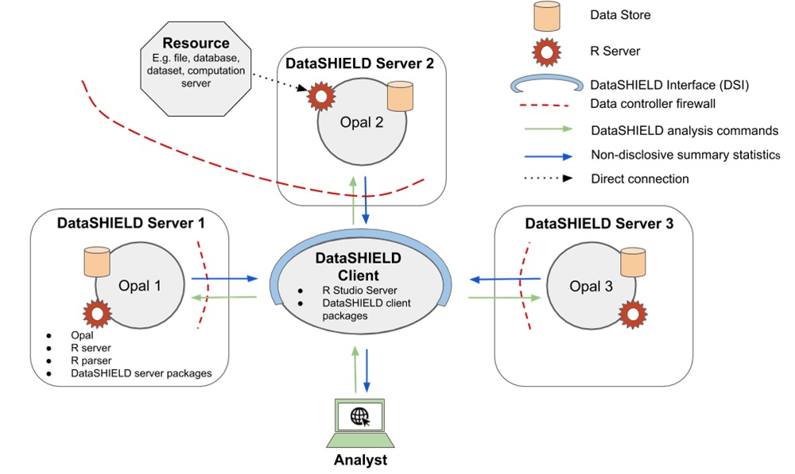

# DataSHIELD

## Introduction

Some research projects require pooling data from several studies to obtain sample sizes large and diverse enough for detecting interactions. Unfortunately, important ethico-legal constraints often prevent or impede the sharing of individual-level data across multiple studies. DataSHIELD aims to address this issue. DataSHIELD is a method that enables advanced statistical analysis of individual-level data from several sources without actually pooling the data from these sources together. DataSHIELD facilitates important research in settings where:
 
* a co-analysis of individual-level data from several studies is scientifically necessary but governance restrictions prevent the release or sharing of some of the required data, and/or render data access unacceptably slow, 
* equivalent governance concerns prevent or hinder access to a single dataset,
* a research group wishes to actively share the information held in its data with others but does not wish to cede control of the governance of those data and/or the intellectual property they represent by physically handing over the data themselves,
* a dataset which is to be remotely analysed, or included in a multi-study co-analysis, contains data objects (e.g. images) which are too large to be physically transferred to the analysis location.

A typical DataSHIELD infrastructure (see Figure \@ref(fig:dsArchitec)) is composed of one analysis node (the DataSHIELD client) connected to one or several data analysis nodes (the DataSHIELD servers). In each of these server nodes, there is an R server application which can only be accessed through a DataSHIELD-compliant middleware application. This middleware application acts as a broker for managing R server sessions in a multi-user environment, assigning data and launching analysis on the R server. The analysis execution environment is then fully controlled: users must be authenticated, must have the proper permissions to access the data of interest and can only perform some predefined assignment and aggregation operations. Importantly, the operations that are permitted are designed to prevent the user having access to individual data items while still allowing useful work to be done with the data. For example, users can fit a generalised linear model to a dataset and receive information about the model coefficients, but are not given the residuals, as these could be used to reconstruct the original data.The reference implementation of this DataSHIELD infrastructure is based on the [Opal](http://opaldoc.obiba.org/) data repository. 

```{r dsArchitec, echo=FALSE, fig.cap="Typical DataSHIELD infrastructure, including one central analysis node (client) and several data nodes (servers). ", out.width = '80%', fig.align='center'}

```

The client node interacts programmatically in R with the server nodes using the DataSHIELD Interface implemented as the [DSI](https://cran.r-project.org/package=DSI) R package. The DSI defines prototype functions to authenticate the user and to perform assignment and aggregation operations in each of the R servers sitting in the server nodes. The reference implementation of DSI is the [DSOpal](https://cran.r-project.org/package=DSOpal) R package. An alternate implementation of DSI is [DSLite](https://cran.r-project.org/package=DSLite), an R package targetted at DataSHIELD developers by offering a lightweight, pure R implementation of the whole DataSHIELD infrastructure.

```{r include = FALSE, eval=FALSE}
download.file("https://github.com/isglobal-brge/resource_bookdown/raw/master/01-Opal.Rmd", "rmd_datashield/opal.Rmd")
```

```{r child='rmd_datashield/opal.Rmd', include=TRUE}
```


```{r include = FALSE, eval=FALSE}
download.file("https://github.com/isglobal-brge/resource_bookdown/raw/master/04-resources.Rmd", "rmd_datashield/resources.Rmd")
```

```{r child='rmd_datashield/resources.Rmd', include=TRUE}
```

```{r include = FALSE, eval=FALSE}
download.file("https://github.com/isglobal-brge/resource_bookdown/raw/master/02-DataSHIELD.Rmd", "rmd_datashield/DataSHIELD.Rmd")
```

```{r child='rmd_datashield/DataSHIELD.Rmd', include=TRUE}
```

```{r include = FALSE, eval=FALSE}
download.file("https://github.com/isglobal-brge/resource_bookdown/raw/master/07-workflow2_simple_analyses.Rmd", "rmd_datashield/analyses.Rmd")
```

```{r child='rmd_datashield/analyses.Rmd', include=TRUE}
```

```{r include = FALSE, eval=FALSE}
download.file("https://github.com/isglobal-brge/resource_bookdown/raw/master/13-Useful_information.Rmd", "rmd_datashield/info.Rmd")
```

```{r child='rmd_datashield/info.Rmd', include=TRUE}
```