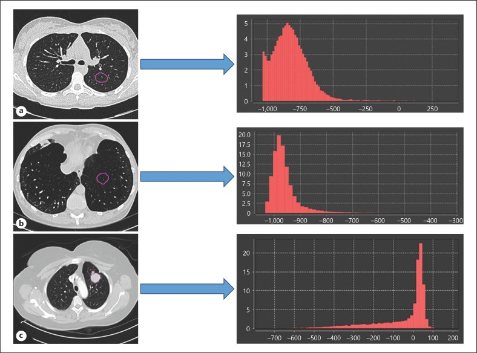
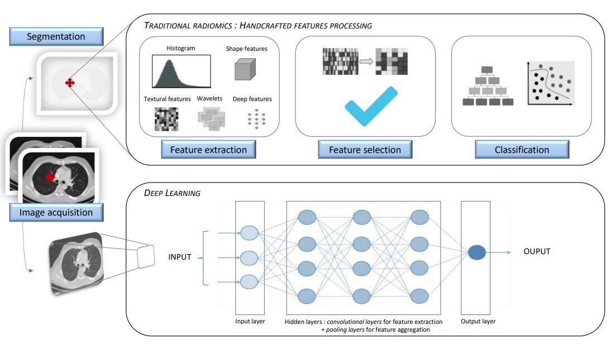
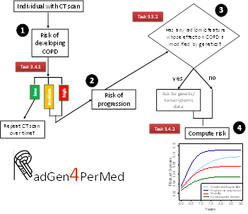
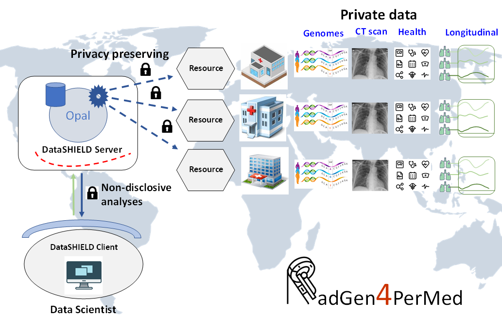

```{r setup, include=FALSE}
knitr::opts_chunk$set(echo = TRUE, comment="", 
                      message=FALSE, warning=FALSE, 
                      cache=FALSE, fig.width = 4, fig.height = 4)
options(width=80)
```

## Credits

[R for Data Science:](http://r4ds.had.co.nz/index.html) http://r4ds.had.co.nz/index.html


## Outline of the course

* Day 1: Reproducible Research (30 min)
     - knitr
     - R markdown 

* Day 1: Tidyverse - Data wrangling (1h)
     - Tibbles
     - Data import
     - Filter rows
     - Arrange rows
     - Select columns
     - Add columns
     - Grouped summaries

* Day 1: Tidyverse - Data visualization (Online)
     - Exploratory data analysis 
     - Advanced graphics

-----

* Day 2: Model fitting (1h)
     - Linear regression
     - Generalized linear models
     - Multivariate regression
     - General rules for variable selection
     - Stepwise variable selection
     - Comparing models
     - Automatic variable selection
     
* Day 2: DataSHIELD (1h)
     - Introduction
     - Opal demo server

-----


* Day 3: DataSHIELD (2h)
     - Creating tables in Opal
     - Creating resources in Opal
     - Descriptive statistics
     - Generalized linear models
     
     
-----

## Course Material and tasks

* Slides, pdf, supplementary info at Moodle
* Material available at [https://isglobal-brge.github.io/Master_Modelling/](https://isglobal-brge.github.io/Master_Modelling/)
* Tasks
     - Daily exercises (Slides + Moodle)
     - Final exercise (Moodle) 

-----

## Evaluation

- 5 Tasks
     - R Markdown (10%)
     - Tidyverse (20%)
     - Data visualization (20%)
     - Data modelling (20%)
     - DataSHIELD (30%)
     
     
-----

## Final Master project proposal (+ internship)

- Radiomics (Radiogenomics)
     - COVID lung CT scans + GWAS
     - Neurobiology brain MRI scans + GWAS
     - COPD lung CT scans + GWAS


```{r, fig.align='right', echo=FALSE}

```


## Final Master project proposal (+ internship)

 


## Final Master project proposal (+ internship)



## Final Master project proposal (+ internship)

     